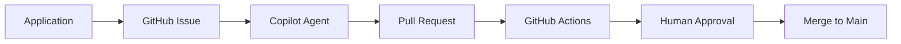
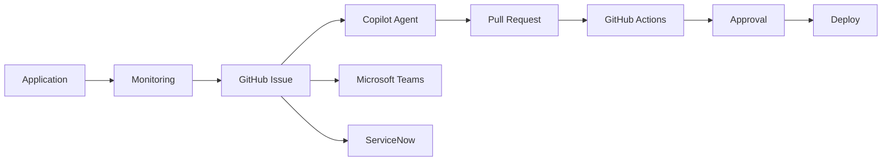
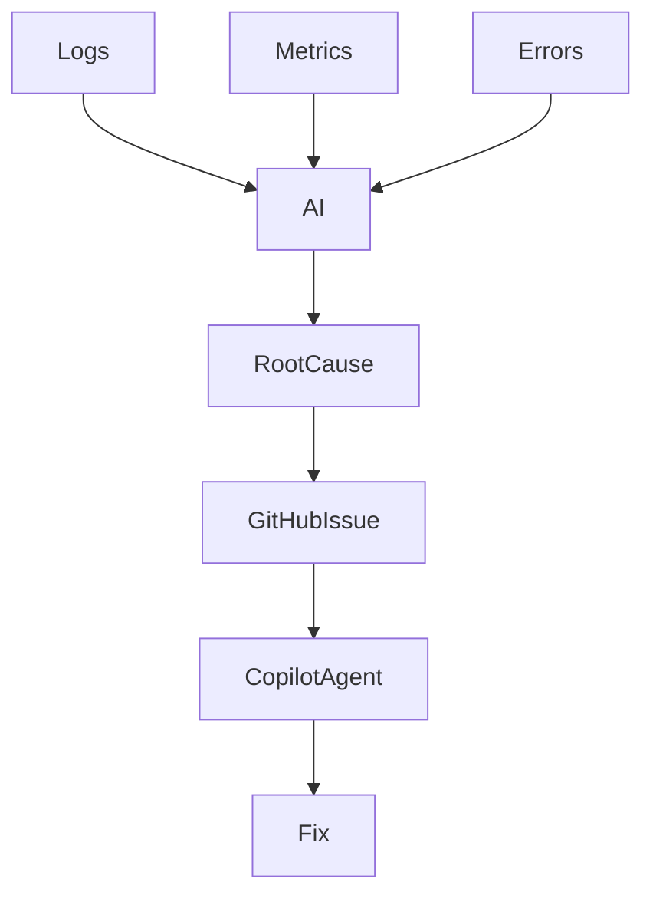
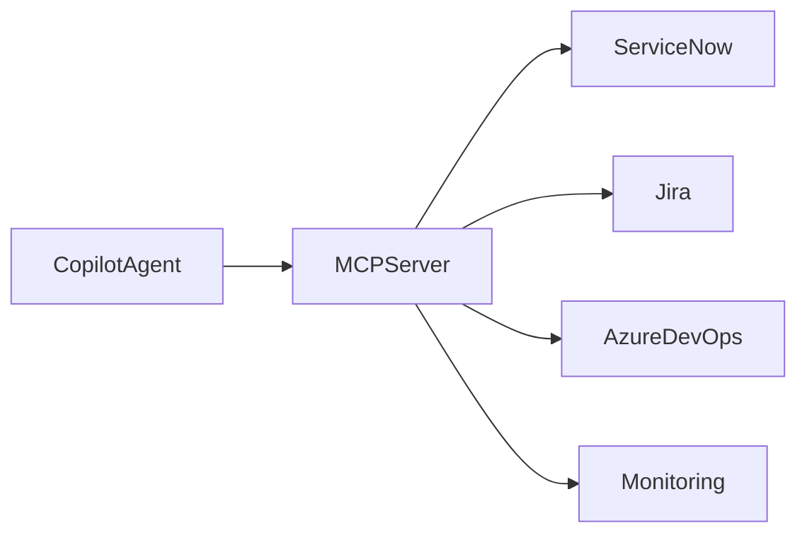
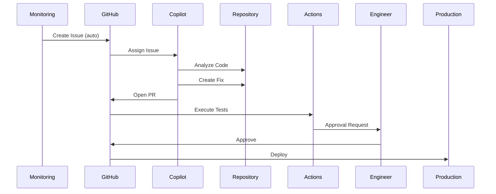

# Architecture Diagrams

## Phase 1 — MVP

```mermaid
flowchart LR
    A[Application] --> B[GitHub Issue]
    B --> C[Copilot Agent]
    C --> D[Pull Request]
    D --> E[GitHub Actions]
    E --> F[Human Approval]
    F --> G[Merge to Main]
```

## Phase 2 — Enterprise

```mermaid
flowchart LR
    A[Application] --> B[Monitoring]
    B --> C[GitHub Issue]
    C --> D[Copilot Agent]
    D --> E[Pull Request]
    E --> F[GitHub Actions]
    F --> G[Approval]
    G --> H[Deploy]
    C --> I[Microsoft Teams]
    C --> J[ServiceNow]
```

## Phase 3 — AI Root Cause Analysis

```mermaid
flowchart TD
    Logs --> AI
    Metrics --> AI
    Errors --> AI
    AI --> RootCause
    RootCause --> GitHubIssue
    GitHubIssue --> CopilotAgent
    CopilotAgent --> Fix
```

## Phase 4 — MCP Server

```mermaid
flowchart LR
    CopilotAgent --> MCPServer
    MCPServer --> ServiceNow
    MCPServer --> Jira
    MCPServer --> AzureDevOps
    MCPServer --> Monitoring
```

## Phase 5 — Autonomous Operations (Full Sequence)

```mermaid
sequenceDiagram
    Monitoring->>GitHub: Create Issue (auto)
    GitHub->>Copilot: Assign Issue
    Copilot->>Repository: Analyze Code
    Copilot->>Repository: Create Fix
    Copilot->>GitHub: Open PR
    GitHub->>Actions: Execute Tests
    Actions->>Engineer: Approval Request
    Engineer->>GitHub: Approve
    GitHub->>Production: Deploy
```
